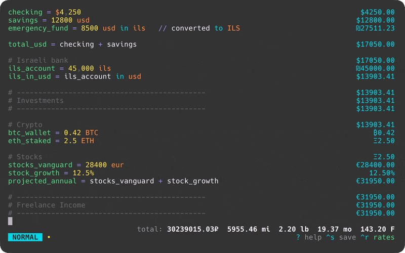
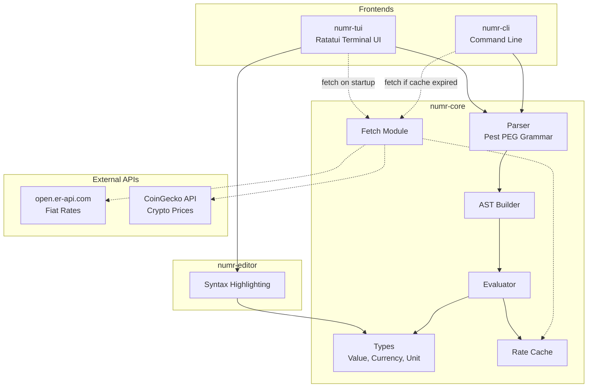

<p align="center">
<pre>
███    ██ ██    ██ ███    ███ ██████
████   ██ ██    ██ ████  ████ ██   ██
██ ██  ██ ██    ██ ██ ████ ██ ██████
██  ██ ██ ██    ██ ██  ██  ██ ██   ██
██   ████  ██████  ██      ██ ██   ██
</pre>
</p>

<p align="center">
  <a href="https://github.com/nasedkinpv/numr/actions/workflows/ci.yml"></a>
</p>

A text calculator for natural language expressions with a vim-style TUI.

<p align="center">
  <strong><a href="https://numr.cc">Try it online →</a></strong>
</p>

<p align="center">
  
</p>

## Features

- **Natural language expressions**: `20% of 150`, `$100 in euros`, `2 hours + 30 min`
- **Variables**: `tax = 15%` then `100 + tax`
- **Unit conversions**: Length, weight, time, temperature, data sizes
- **Compound units**: `5 m * 10 m = 50 m²`, `100 km / 2 h = 50 km/h`
- **Currency conversions**: USD, EUR, GBP, JPY, CHF, CNY, CAD, AUD, INR, KRW, RUB, ILS, PLN, UAH + crypto (BTC, ETH, SOL, and more)
- **Live exchange rates**: Fetched automatically on startup
- **Dual keybinding modes**: Vim (modal) or Standard (direct input) - toggle with `Shift+Tab`
- **Mouse support**: Scroll with mouse wheel or trackpad
- **File persistence**: Auto-saves to config directory, supports custom files
- **Syntax highlighting**: Numbers, operators, variables, units, and currencies
- **Comments**: Lines starting with `#` or `//` are treated as comments
- **Continuation**: Start a line with an operator (`+ 10`, `* 2`) to continue from the previous result
- **Wrap mode**: Toggle text wrapping with bottom-aligned results
- **Grouped totals**: Currencies and units summed separately in footer (respects exchange rates)

## Installation

### macOS (Homebrew)

```bash
brew tap nasedkinpv/tap
brew install numr
```

### Arch Linux (AUR)

```bash
# Using yay
yay -S numr

# Using paru
paru -S numr
```

### From source

```bash
# Install from source
cargo install --path crates/numr-tui

# Or build from source
cargo build --release

# Binary will be available at target/release/numr
```

## Usage

### TUI Mode

```bash
# Open default file (~/.config/numr/default.numr)
numr

# Open specific file
numr example.numr
```

### CLI Mode

```bash
# Single expression
numr-cli "20% of 150"

# Evaluate file
numr-cli -f example.numr

# Interactive REPL
numr-cli -i

# Pipe mode
echo "100 + 200" | numr-cli
```

### JSON-RPC Server Mode

Run numr as a backend for other tools (editors, launchers, scripts):

```bash
numr-cli --server
```

Send JSON-RPC 2.0 requests via stdin, receive responses via stdout:

```bash
echo '{"jsonrpc":"2.0","method":"eval","params":{"expr":"20% of 150"},"id":1}' | numr-cli --server
# {"jsonrpc":"2.0","result":{"type":"number","value":30.0,"display":"30"},"id":1}
```

**Available methods:**

| Method | Params | Description |
|--------|--------|-------------|
| `eval` | `{"expr": "..."}` | Evaluate expression |
| `eval_lines` | `{"lines": [...]}` | Evaluate multiple lines |
| `clear` | none | Clear state |
| `get_totals` | none | Get grouped totals |
| `get_variables` | none | List variables |
| `reload_rates` | none | Refresh exchange rates |

## Keybindings (TUI)

The TUI supports two keybinding modes: **Vim** (default) and **Standard**. Press `Shift+Tab` to toggle between them.

### Vim Mode

#### Normal Mode

| Key | Action |
|-----|--------|
| `i` / `a` | Enter Insert mode at/after cursor |
| `I` / `A` | Enter Insert mode at line start/end |
| `o` / `O` | New line below/above and enter Insert mode |
| `s` | Substitute character (delete and insert) |
| `C` | Change to end of line |
| `h` / `j` / `k` / `l` | Move left/down/up/right |
| `w` / `b` / `e` | Word forward/backward/end |
| `0` / `$` | Line start/end |
| `gg` / `G` | First/last line |
| `Space` | Move right |
| `PageUp/Down` | Scroll page |
| `x` / `X` | Delete char forward/backward |
| `dd` | Delete line |
| `D` | Delete to end of line |
| `J` | Join lines |
| `W` / `N` / `H` | Toggle wrap/line numbers/header |
| `?` / `F1` | Toggle help |
| `Ctrl+s` | Save |
| `Ctrl+r` | Refresh rates |
| `F12` | Toggle debug |
| `Shift+Tab` | Switch to Standard mode |
| `q` | Quit |

#### Insert Mode

| Key | Action |
|-----|--------|
| `Esc` | Return to Normal mode |
| Type | Insert text |
| `Backspace` / `Delete` | Delete char backward/forward |
| `Enter` | New line |
| `Arrows` / `PageUp/Down` | Navigate |
| `Home` / `End` | Line start/end |
| `Ctrl+s` | Save |

### Standard Mode

Direct input like traditional editors - no modal switching required.

| Key | Action |
|-----|--------|
| Type | Insert text directly |
| `Arrow keys` | Move cursor |
| `Home` / `End` | Line start/end |
| `PageUp/Down` | Scroll page |
| `Ctrl+a` / `Ctrl+e` | Line start/end |
| `Ctrl+g` | Go to first line |
| `Backspace` / `Delete` | Delete char |
| `Ctrl+k` | Delete line |
| `Enter` | New line |
| `Ctrl+w/l/h` | Toggle wrap/line numbers/header |
| `?` / `F1` | Toggle help |
| `Ctrl+s` | Save |
| `Ctrl+r` | Refresh rates |
| `Shift+Tab` | Switch to Vim mode |
| `Ctrl+q` | Quit |

## Supported Operations

### Arithmetic
```
10 + 20           → 30
100 - 25          → 75
6 * 7             → 42
100 / 4           → 25
2 ^ 8             → 256
```

### Percentages
```
20% of 150        → 30
100 + 15%         → 115
$50 - 10%         → $45
```

### Variables
```
price = $100
tax = 8%
price + tax       → $108
```

### Comments
```
# This is a comment
// This is also a comment
Groceries         $45.00
# Comments are dimmed and ignored in calculations
```

### Continuation
```
$100              → $100
+ $50             → $150 (continues from previous)
* 2               → $300
- 10%             → $270
total = _         → $270 (_ or ANS references previous result)
```

### Functions
```
sum(10, 20, 30)   → 60
avg(10, 20, 30)   → 20
min(5, 3, 8)      → 3
max(5, 3, 8)      → 8
sqrt(16)          → 4
abs(-5)           → 5
round(3.7)        → 4
floor(3.7)        → 3
ceil(3.2)         → 4
```

### Compound Units
```
# Area from multiplication
5 m * 10 m        → 50 m²

# Speed from division
100 km / 2 h      → 50 km/h

# Distance from speed × time
50 kph * 2 h      → 100 km

# Unit conversions
50 kph in mps     → 13.89 m/s

# Mixed operations
25 km / 100 km    → 0.25 (dimensionless)
```

**Compound unit aliases**: `kph` (km/h), `mph` (mi/h), `mps` (m/s), `m2` (m²), `km2` (km²), `ft2` (ft²)

## Supported Units

### Length
`km`, `m`, `cm`, `mm`, `mi`/`miles`, `ft`/`feet`, `in`/`inches`

### Area
`m²`/`m2`, `km²`/`km2`, `ft²`/`ft2`, `acre`, `hectare`/`ha`

### Speed
`m/s`/`mps`, `km/h`/`kph`, `mph`, `knot`

### Weight
`kg`, `g`, `mg`, `lb`/`lbs`, `oz`, `ton`

### Volume
`L`, `mL`, `gal`, `m³`/`m3`

### Time
`months`/`mo`, `weeks`/`wk`, `days`/`d`, `hours`/`hr`/`h`, `minutes`/`min`, `seconds`/`sec`/`s`

### Energy
`J`, `kJ`, `cal`, `kcal`, `kWh`

### Power
`W`, `kW`

### Temperature
`K`/`Kelvin`, `C`/`Celsius`, `F`/`Fahrenheit`

### Data
`TB`, `GB`, `MB`, `KB`, `bytes`

### Currencies

**Fiat:** `$`/`USD`, `€`/`EUR`, `£`/`GBP`, `¥`/`JPY`, `CHF`, `CNY`/`RMB`, `CAD`, `AUD`, `₹`/`INR`, `₩`/`KRW`, `₽`/`RUB`, `₪`/`ILS`, `zł`/`PLN`, `₴`/`UAH`

**Crypto:** `₿`/`BTC`, `Ξ`/`ETH`, `◎`/`SOL`, `₮`/`USDT`, `USDC`, `BNB`, `XRP`, `₳`/`ADA`, `Ð`/`DOGE`, `DOT`, `Ł`/`LTC`, `LINK`, `AVAX`, `MATIC`, `TON`

## Architecture



```
numr/
├── crates/
│   ├── numr-core/     # Core evaluation engine (WASM-compatible)
│   │   ├── parser/    # Pest PEG grammar and AST builder
│   │   ├── eval/      # Expression evaluation with unit/currency handling
│   │   ├── types/     # Value, Currency, Unit registries
│   │   ├── cache/     # Exchange rate caching with BFS path finding
│   │   └── fetch/     # HTTP fetching (optional "fetch" feature)
│   ├── numr-editor/   # Syntax highlighting (WASM-compatible)
│   ├── numr-tui/      # Terminal UI (Ratatui) with vim modes
│   └── numr-cli/      # Command-line interface and REPL
```

The core library (`numr-core`) is UI-agnostic and can be embedded in CLI, TUI, GUI, or WASM contexts. The `fetch` feature flag enables HTTP fetching (adds reqwest dependency, not WASM-compatible).

Exchange rates are cached to `~/.config/numr/rates.json` with 1-hour expiry. Both TUI and CLI share this cache:
- **TUI**: Fetches fresh rates on startup
- **CLI**: Fetches only if cache is expired

Rate sources:
- **Fiat currencies**: [open.er-api.com](https://open.er-api.com) (152 currencies, free)
- **Cryptocurrency**: [CoinGecko](https://www.coingecko.com/en/api) (15 tokens, free)

## Integrations

- [elephant-numr](https://github.com/nasedkinpv/elephant-numr) — Provider for [Walker/Elephant](https://github.com/abenz1267/walker) launcher

## License

MIT

