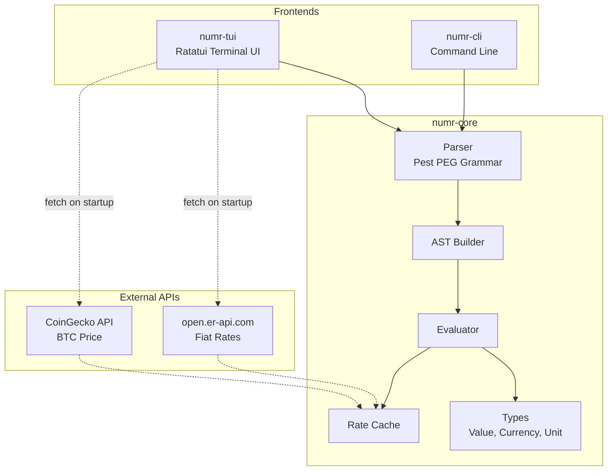

# numr

[](https://github.com/nasedkinpv/numr/actions/workflows/ci.yml)

A text calculator for natural language expressions with a vim-style TUI.

```
Groceries         $45.00              $45.00
Restaurant        $32.50              $32.50
tax = 20%                               0.2
20% of $32.50                         $6.50
                                ───────────
                          total     $84.50
```

## Features

- **Natural language expressions**: `20% of 150`, `$100 in euros`, `2 hours + 30 min`
- **Variables**: `tax = 15%` then `100 + tax`
- **Unit conversions**: length, weight, time, data sizes
- **Currency conversions**: USD, EUR, GBP, JPY, RUB, ILS, BTC
- **Live exchange rates**: Fetched automatically on startup
- **Vim-style editing**: Normal and Insert modes with familiar keybindings
- **File persistence**: Auto-saves to config directory, supports custom files
- **Syntax highlighting**: Numbers, operators, variables, units, and currencies
- **Comments**: Lines starting with `#` are treated as comments
- **Wrap mode**: Toggle text wrapping with bottom-aligned results
- **Running total**: Automatic sum displayed in the footer

## Installation

```bash
# Build from source
cargo build --release

# Run TUI
cargo run --bin numr

# Run with a specific file
cargo run --bin numr -- myfile.numr
```

## Usage

### TUI Mode

```bash
# Open default file (~/.config/numr/default.numr)
numr

# Open specific file
numr calculations.numr
```

### CLI Mode

```bash
# Single expression
numr-cli "20% of 150"

# Evaluate file
numr-cli -f calculations.numr

# Interactive REPL
numr-cli -i

# Pipe mode
echo "100 + 200" | numr-cli
```

## Keybindings (TUI)

### Normal Mode

| Key | Action |
|-----|--------|
| `i` | Enter Insert mode |
| `a` | Enter Insert mode after cursor |
| `A` | Enter Insert mode at end of line |
| `o` | New line below and enter Insert mode |
| `h` / `←` | Move left |
| `j` / `↓` | Move down |
| `k` / `↑` | Move up |
| `l` / `→` | Move right |
| `0` | Move to start of line |
| `$` | Move to end of line |
| `x` | Delete character under cursor |
| `dd` | Delete current line |
| `w` | Toggle wrap mode |
| `q` | Quit |
| `Ctrl+s` | Save file |
| `F12` | Toggle debug mode |

### Insert Mode

| Key | Action |
|-----|--------|
| `Esc` | Return to Normal mode |
| `Enter` | New line |
| `Backspace` | Delete character before cursor |
| `Delete` | Delete character after cursor |
| `Ctrl+s` | Save file |
| `F12` | Toggle debug mode |

## Supported Operations

### Arithmetic
```
10 + 20           → 30
100 - 25          → 75
6 * 7             → 42
100 / 4           → 25
2 ^ 8             → 256
```

### Percentages
```
20% of 150        → 30
100 + 15%         → 115
$50 - 10%         → $45
```

### Variables
```
price = $100
tax = 8%
price + tax       → $108
```

### Comments
```
# This is a comment
Groceries         $45.00
# Comments are dimmed and ignored in calculations
```

### Functions
```
sum(10, 20, 30)   → 60
avg(10, 20, 30)   → 20
min(5, 3, 8)      → 3
max(5, 3, 8)      → 8
sqrt(16)          → 4
abs(-5)           → 5
round(3.7)        → 4
floor(3.7)        → 3
ceil(3.2)         → 4
```

## Supported Units

### Length
`km`, `m`, `cm`, `mm`, `mi`/`miles`, `ft`/`feet`, `inches`

### Weight
`kg`, `g`, `mg`, `lb`/`lbs`, `oz`

### Time
`hours`/`hr`/`h`, `minutes`/`min`, `seconds`/`sec`/`s`, `days`/`d`, `weeks`/`wk`

### Data
`TB`, `GB`, `MB`, `KB`, `bytes`

### Currencies
`$`/`USD`, `€`/`EUR`, `£`/`GBP`, `¥`/`JPY`, `₽`/`RUB`, `₪`/`ILS`, `₿`/`BTC`

## Architecture



```
numr/
├── crates/
│   ├── numr-core/     # Core evaluation engine (no UI dependencies)
│   │   ├── parser/    # Pest PEG grammar and AST builder
│   │   ├── eval/      # Expression evaluation with unit/currency handling
│   │   ├── types/     # Value, Currency, Unit registries
│   │   └── cache/     # Exchange rate caching with BFS path finding
│   ├── numr-tui/      # Terminal UI (Ratatui) with vim modes
│   └── numr-cli/      # Command-line interface and REPL
```

The core library (`numr-core`) is UI-agnostic and can be embedded in CLI, TUI, GUI, or WASM contexts. Exchange rates are fetched asynchronously on TUI startup from two sources:
- **Fiat currencies**: [open.er-api.com](https://open.er-api.com) (152 currencies, free)
- **Cryptocurrency**: [CoinGecko](https://www.coingecko.com/en/api) (BTC/USD, free)

## License

MIT
