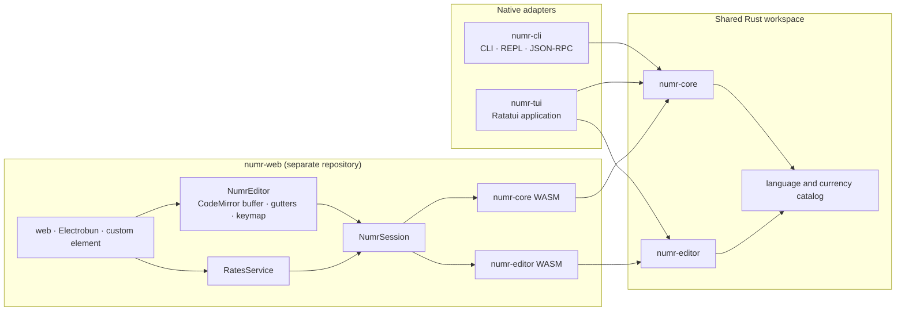
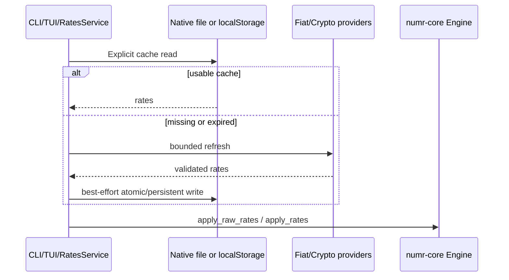

# Architecture

This document describes the 0.8.0 component boundaries and the interfaces intended for reuse. The main rule is simple: calculation semantics live in `numr-core`; frontends own presentation and I/O policy.

## Component Map



### `numr-core`

`numr-core` owns parsing, evaluation, values, units, currencies, grouped totals, exchange-rate graph semantics, and shared language metadata. It has no UI dependency.

`Engine::new()` is deterministic and has no filesystem or network side effects. Native adapters explicitly call `load_rates_from_cache`, `save_rates_to_cache`, and optional `fetch` APIs. Browser adapters inject rates with the WASM `apply_rates` boundary. Tests and embedders can supply a caller-created `RateCache` through `Engine::with_rate_cache`.

The main evaluation surfaces are:

- `eval`: evaluate and append one stateful line.
- `eval_preview`: evaluate against a cloned context without changing document history.
- `evaluate_document`: clear existing state, evaluate a complete document, and return a `DocumentResult` containing lines, grouped totals, and sorted user variables.
- `append_lines`: append multiple lines to existing state without clearing it.

`LineResult` records the input, value, continuation-consumption state, and whether the line is a display-only aggregate. Continuations only consume the preceding successful value when their evaluation succeeds. Aggregate queries do not feed later totals.

The parser applies resource checks before Pest or the recursive evaluator receives input. Defaults are 16 KiB per expression, 256 operation tokens, 128 parenthesis levels, and at most 128 fuzzy suffix attempts. Callers that need tighter expression limits can use `parse_line_with_limits` or `try_parse_exact_with_limits`.

Failures cross the core boundary as typed errors:

- `ParseError` describes syntax and parser resource limits.
- `EvalError` describes checked arithmetic, division, operands, variables, functions, and conversions.
- `RateError` describes rate validation, network responses, and cache/filesystem failures.

The evaluator uses checked Decimal operations on user-controlled paths so invalid or extreme input becomes a `Value::Error` instead of a process panic.

`catalog` is the source of truth for `BUILTIN_FUNCTIONS`, `KEYWORDS`, `MATH_CONSTANTS`, `ANSWER_ALIASES`, and `currency_catalog()`. The editor and web rate provider consume this metadata rather than maintaining independent language tables.

### `numr-editor`

`numr-editor` owns UI-agnostic semantic tokenization and small UTF-8 text primitives such as character-to-byte index conversion. It does not own an editable buffer or document state. Native and WASM frontends supply their known variable names to `tokenize_with_variables` when they need semantic variable highlighting.

### `numr-cli`

`numr-cli` adapts the core to one-shot expressions, files, stdin, a REPL, and a JSON-RPC server. It explicitly loads the filesystem rate cache. Ordinary CLI modes fetch rates only when no usable cache exists; server mode remains offline until a client calls `reload_rates`.

The JSON-RPC parser/validator/dispatcher is independent of stdin/stdout, which keeps protocol tests on the same path as production. See [json-rpc.md](json-rpc.md) for the wire contract.

### `numr-tui`

`numr-tui` owns the document buffer, cursor/viewport state, keybindings, configuration, persistence, and terminal lifecycle. The core and editor remain unaware of Ratatui.

The main loop is event-driven. It redraws after input, state changes, or while a status/rate animation is active; idle documents do not run at a fixed frame rate. Document evaluation refreshes a cached render state containing formatted results, errors, variable names, totals, and result widths, and the renderer limits widget work to visible content.

Documents and configuration use same-directory atomic replacement after flushing and syncing the temporary file. A terminal RAII guard restores raw mode, alternate screen, mouse capture, and cursor visibility across normal exits and errors.

Rate refreshes use one long-lived background thread with one current-thread Tokio runtime. Requests are coalesced while a fetch is active, so repeated refresh input does not create overlapping runtimes or HTTP work.

### `numr-web`

`numr-web` is a separate Git repository, not a submodule. For compatible local and CI builds it is checked out at `numr/numr-web`, next to `numr/crates`.

`NumrSession` is the stable JavaScript adapter around generated bindings. It owns WASM payload parsing and exposes plain JavaScript document results, totals, variable names, tokens, currency metadata, and rate application. Views do not parse generated WASM JSON directly.

`RatesService` is the single browser policy for rate cache age, provider requests, timeouts, concurrent fiat/crypto loading, partial-provider success, coalesced refreshes, and cleanup. It obtains crypto provider IDs from the core currency catalog, retaining a compatibility fallback only for older WASM packages.

`NumrEditor` is the only browser editor implementation. It owns the CodeMirror document/history, standard platform keymap, visible-range semantic decorations, line/error gutter, result gutter, and scrolling. It calls `NumrSession` for whole-document evaluation and tokenization; it does not introduce a JavaScript parser. The standalone site and Electrobun use the same application entrypoint, while the native custom element is a thin Shadow DOM shell around the same editor controller.

Safe token DOM/range mapping and WASM module loading are shared modules. A failed WASM import is removed from the loader cache so a later attempt can recover.

Bun locally bundles CodeMirror into the committed standalone and custom-element entrypoints. There are no runtime CDN dependencies. The npm package file list contains the self-contained custom element, TypeScript declarations, and both generated WASM packages under `pkg/core` and `pkg/editor`.

## Rate Data Flow



The core decides how rates form conversion paths. Adapters decide when and where to load or persist them.

## Build Boundaries

The workspace MSRV is Rust 1.88. Native release builds use `opt-level = 3`, LTO, one codegen unit, stripping, and aborting panics. Web build entrypoints override the release optimization level to `z`, and `wasm-pack` applies `wasm-opt -Oz`.

WASM compatibility is checked explicitly for both crates:

```bash
cargo check --locked -p numr-core --target wasm32-unknown-unknown --no-default-features --features wasm
cargo check --locked -p numr-editor --target wasm32-unknown-unknown --no-default-features --features wasm
cargo check --locked -p numr-core --target wasm32-unknown-unknown --all-features
```

The separate web CI checks out both repositories into the required sibling layout, installs the frozen Bun lockfile, runs JavaScript contract tests, rebuilds both WASM packages and browser entrypoints with `--locked`, and fails if generated bindings or asset-version stamps differ from committed files.

## Dependency Direction

Keep dependencies pointing inward:

1. Views depend on frontend adapters.
2. Frontend adapters depend on `numr-core`/`numr-editor` public interfaces.
3. `numr-editor` may consume core catalogs but not frontend state.
4. `numr-core` must not depend on CLI, TUI, browser, or desktop concerns.
5. Filesystem, network, terminal, and DOM side effects stay at explicit adapter boundaries.

When adding a cross-frontend feature, extend the core document/catalog contract first, then keep each adapter thin.
